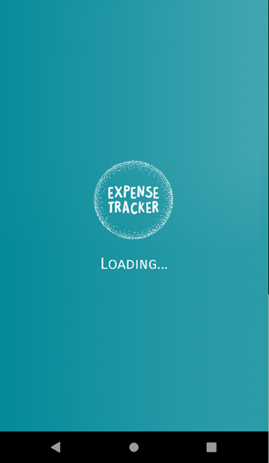
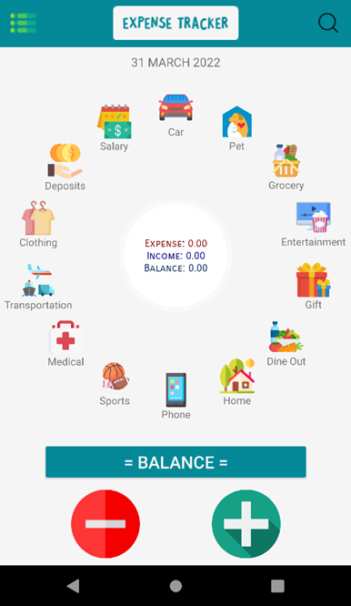
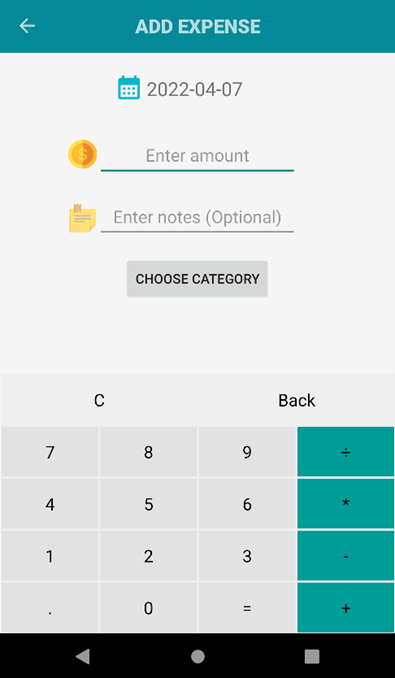
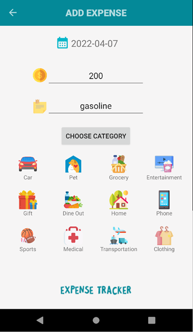

# Expense Tracker App 💰

An Android-based Expense Tracker application developed using Java in Android Studio.  
This application helps users manage daily income and expenses efficiently with interactive charts and categorized records.

---

# 📌 Project Overview

Expense Tracker is a smart financial management application that allows users to record their income and expenses in different categories.  
The app provides real-time balance calculation, transaction history, and graphical analysis using Pie Charts for better expense tracking.

---

# 📱 Features

## 🏠 Dashboard / Main Page
- Interactive Pie Chart for expense analysis
- Displays category-wise expense percentage
- Shows total income, expense, and balance
- Clean and user-friendly interface

## 💸 Expense Management
- Add daily expenses
- Select category and date
- Store data locally using SQLite Database
- Automatically updates pie chart analytics

## 💵 Income Management
- Add income sources and amount
- Maintain complete balance records
- Easy data insertion interface

## 🔍 Search Functionality
- Search expenses by category
- View complete transaction history
- Delete records instantly

## 📊 Data Visualization
- Pie Chart integration using MPAndroidChart
- Real-time financial tracking
- Expense percentage visualization

---

# 🛠️ Technologies Used

- Java
- Android Studio
- SQLite Database
- RecyclerView
- ListView
- GridView
- SearchView
- Navigation Drawer
- MPAndroidChart Library
- XML Layout Design

---

# 📂 Modules

- Splash Screen
- Main Dashboard
- Expense Page
- Income Page
- Search Page
- Database Helper

---

# 📸 Screenshots

## Splash Screen


## Dashboard


## Expense Page


## Category Selection


---

# ⚙️ Installation

## 1️⃣ Clone the Repository

```bash
git clone https://github.com/vishalsingh0226/Expense-Tracker-App.git
